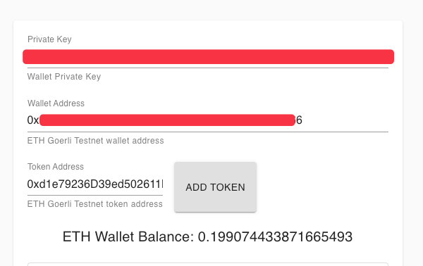
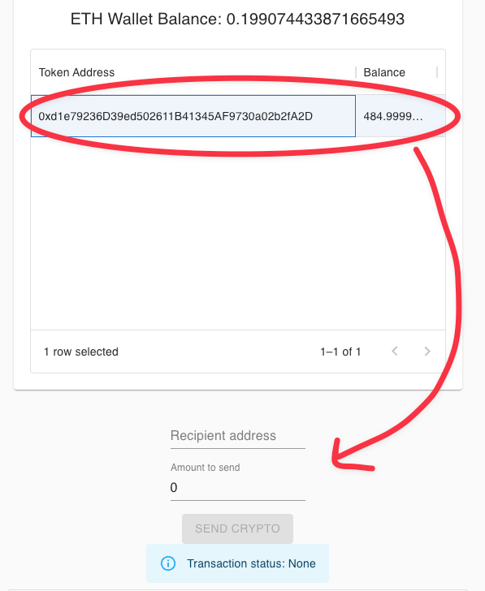
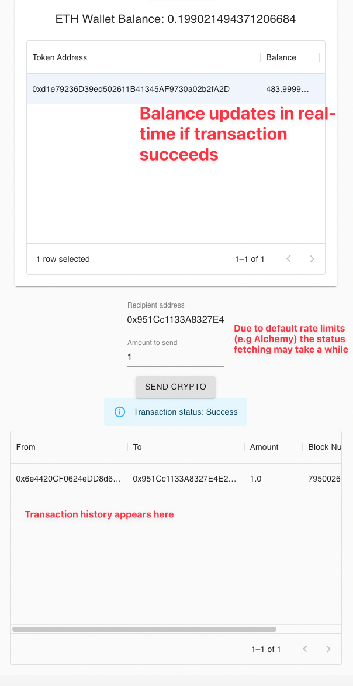

# Notes

This project was bootstrapped with [Create React App](https://github.com/facebook/create-react-app).

1. If `npm i` fails due to `React 18` dependency, run `npm i --force`.
2. In `.env` provide your `ALCHEMY API KEY`. You can sign up here https://www.alchemy.com
3. To start local server run `npm run start`.
4. There is a deployed `Sanic ERC-20 Token`. You can view it under `solidity/contracts/sanicToken.sol`.
5. The token ABI is located under `wallet/src/contracts/sanicTokenAbi.json`.
6. This project uses https://usedapp-docs.netlify.app that relies on Ethers various blockchain providers like Alchemy, Etherscan and etc. But, the default rate limits are pretty bad and you better provide your own API keys for higher rate limit tiers

## User Manual
1. Go to http://localhost:3000/
2. Fill in your wallet's private key, wallet address
3. For token address you can use Sanic token address `0xd1e79236D39ed502611B41345AF9730a02b2fA2D`
4. 
5. Press `Add Token`. The token will appear in the table below.
6. Press on the token in the table and the transfer functionality will unlock
7. 
8. Provide a recipient address and amount to transfer.
9. Keep in mind that due to the low rate limit rates, it may take a while to fetch the transaction status
10. 

### Improvements
1. Add unit component tests
2. Add integration tests with Cypress
